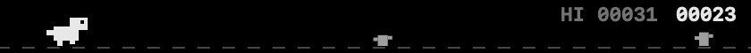

# 터치바 공룡 (TouchBarDino)

> **TouchBarDino** — An endless runner that lives on your MacBook's Touch Bar.
> Tap the strip to jump. That's the whole game.




맥북 터치바에서 돌아가는 크롬 공룡 스타일 러너 게임.
터치바를 탭하면 점프 — 조작은 그게 전부.
터치바에 손 뻗기 귀찮으면 화면에 떠 있는 미니 게임 창을 마우스로 클릭해도 된다.

- 터치바 전체 폭(420pt)을 게임 화면으로 사용, OLED 검정 배경으로 베젤과 이어짐
- 시간이 갈수록 빨라지고, 선인장 군집도 등장
- 최고 기록 저장, 죽어도 탭 한 번으로 즉시 재시작
- 탭은 손가락이 **닿는 순간** 반응 (touch down) — 점프 지연 없음

## 설치 (다운로드)

1. [Releases](https://github.com/eytvchoi83-ai/TouchBarDino/releases)에서
   최신 `TouchBarDino-x.x.x.zip` 다운로드 후 압축 해제
2. `TouchBarDino.app`을 응용 프로그램 폴더로 이동
3. **첫 실행**: 앱을 우클릭 → 열기 → "열기" 확인
   (무료 배포 앱이라 Apple 공증이 없어 첫 1회만 필요합니다)

## 빌드 & 실행

```sh
./build.sh          # TouchBarDino.app 생성
open TouchBarDino.app
```

실행하면 터치바에 게임이 바로 나타납니다.
터치바 오른쪽 컨트롤 스트립의 🎮 버튼으로 열고 닫을 수 있습니다.

## 조작

터치바 게임 화면을 **탭**하거나, 화면에 떠 있는 미니 게임 창을 **클릭** — 동작은 같다.

| 상황 | 탭/클릭 한 번 |
|------|----------|
| 대기 화면 | 게임 시작 |
| 플레이 중 | 점프 |
| 게임 오버 | 재시작 (0.35초 잠금 — 연타 오발 방지) |

미니 게임 창은 항상 위에 떠 있고 포커스를 뺏지 않는다.
배경을 드래그해 옮길 수 있고, 메뉴바 🎮 → "화면에 게임 창 표시"(M)로 켜고 끈다.

## 사운드

전부 코드로 합성한 칩튠 (저작권 걱정 없음, `scripts/make_sounds.py`):

- **점프**: 위로 쓸어올리는 블립 / **착지**: 낮은 툭 / **죽을 때**: 하강 멜로디
- **배경음악**: 조용한 C–Am–F–G 8초 루프 — 플레이 중에만 재생되고
  게임오버·일시정지 시 자동으로 멈춤
- 메뉴바에서 효과음/배경음악 각각 켜고 끌 수 있음

## 메뉴바 (🎮 아이콘)

- 최고 기록 표시 / 초기화
- 터치바에 게임 표시/숨기기 (G), 화면 게임 창 표시 (M)
- 효과음 / 배경음악 토글
- 로그 열기 (`~/Library/Logs/TouchBarDino.log`), 종료 (Q)

## 동작 원리

TouchBarLyrics와 같은 구조:

- Pock 등에서 쓰는 비공개 API(DFRFoundation)로 앱이 포커스되지 않아도
  터치바에 시스템 모달로 표시
- 커스텀 뷰가 합성되지 않는 시스템이 있어, 매 프레임(60fps)을
  2x 비트맵으로 구워 테두리 없는 NSButton 이미지로 표시
- 게임 아이템 폭은 420pt — 이보다 넓으면 NSTouchBar가 조용히
  레이아웃에서 탈락시킴 (TouchBarLyrics에서 얻은 교훈)
- 플레이 중에는 주기적으로 사용자 활동을 선언해 터치바 유휴 소등을 방지

## 한계

- 비공개 API를 사용하므로 macOS 업데이트에서 깨질 수 있음 (Pock과 같은 리스크)
- 터치바가 있는 MacBook Pro (2016–2020)에서만 의미가 있음

## 프로젝트 구조

```
Sources/
  AppDelegate.swift        앱 로직·메뉴·60fps 게임 루프
  GameEngine.swift         물리·장애물·충돌·점수 (좌표 단위 pt)
  GameRenderer.swift       프레임 → 2x 비트맵 렌더링
  TouchBarController.swift 터치바 아이템 관리 + touch down 입력
  TouchBarPrivate.swift    비공개 API 래퍼 (TouchBarLyrics와 동일)
```
